# 💬 About Me

  

---

# 💻 Tech Stack

### 🧠 Languages
    

### ⚙️ Tools
   

### 🧩 Frameworks / Libraries

---

# 📂 Projects

| Title (Year) | Description | Tech Stack | Status | Link |
|--------------|-------------|------------|--------|------|
| Trip on (2025) | A comprehensive web application for travel planning, execution, expense settlement, and review sharing | Java, JavaScript, Spring Boot, MySQL (AWS), Figma | ✅ Completed | [GitHub](https://github.com/amie-lee/trip-on) |
| PerfectButler (2025) | A simulation game where you capture and raise cats as a butler | Unity, C#, Blender | 🚧 In Progress | [GitHub](https://github.com/ComputerGraphics-PerfectButler/PerfectButler) |
| Rapport (2025) | A pre-counseling chatbot MVP that analyzes conversations to calculate depression, anxiety, and stress levels, providing simple reports | Python, Next.js | 🚧 In Progress | [GitHub](https://github.com/amie-lee/Rapport) |

---

# 🏆 Awards

| Name | Award | News Article | Notes |
|------|-------|--------------|-------|
| 2025 단국 창업해커톤 경진대회 | 대상 | [Link](https://www.dankook.ac.kr/web/kor/-550?p_p_id=dku_bbs_web_BbsPortlet&p_p_lifecycle=0&p_p_state=normal&p_p_mode=view&_dku_bbs_web_BbsPortlet_cur=1&_dku_bbs_web_BbsPortlet_sKeyword=해커톤&_dku_bbs_web_BbsPortlet_sKeyType=title&_dku_bbs_web_BbsPortlet_action=view_message&_dku_bbs_web_BbsPortlet_orderBy=createDate&_dku_bbs_web_BbsPortlet_bbsMessageId=157508) | Project: Rapport |
